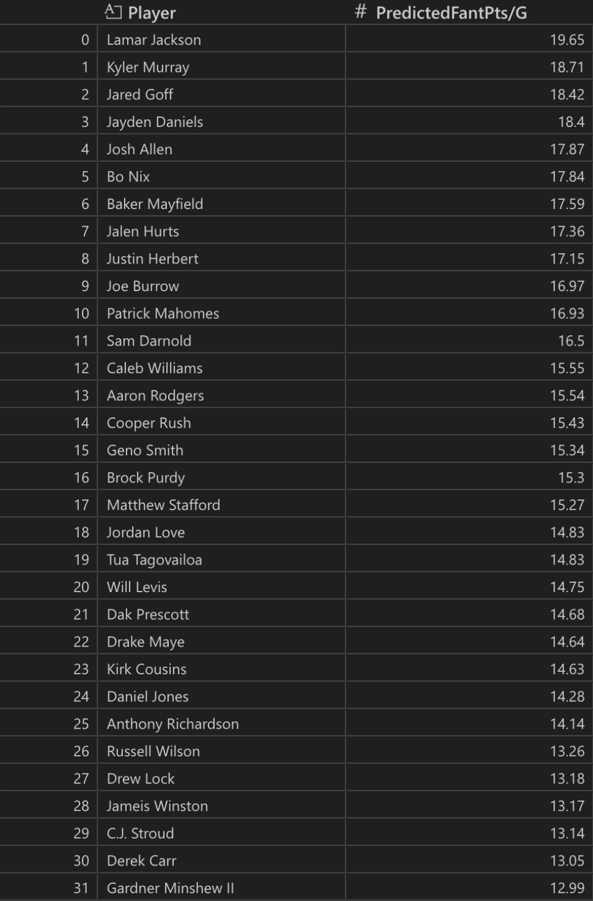

# 2025 Fantasy Football QB Point Predictor
By: Ethan Ooi

This project aims to predict each NFL quarterback's average fantasy points per game for the upcoming 2025 NFL season using historical NFL data and machine learning.
This Fantasy Football Point Predictor uses NFL Data provided by https://www.pro-football-reference.com/. NFL & Fantasy data is collected from the 2004-2024 NFL seasons. 

## Repository Guide
- [data](data): Holds data created from [nfl_stats_scraper.py](nfl_stats_scraper.py).
- [models](models): Holds the trained model .json file.
- [results](results): Holds the final [predictions_2025.csv](results/prediction_2025.csv) and [feature_importance.png](results/feature_importance.png).
- [scripts](scripts): Holds 4 scripts which contain functions used in [main.py](main.py).
- [main.py](main.py): Python script which runs the entire project.
- [nfl_stats_scraper.py](nfl_stats_scraper.py): Scrapes https://www.pro-football-reference.com/ for QB data, saves to [data](data).
- [README.md](README.md): This file.
- [requirements.txt](requirements.txt): Installation versions to properly run scripts.
  
## Methodology
I created a machine learning pipeline using historical data from the 2004-2024 NFL seasons. My goal is to predict QB's average fantasy points per game in the upcoming 2025 NFL season.

## Data Collection & Cleaning
I scraped NFL data from https://www.pro-football-reference.com/ using [nfl_stats_scraper.py](nfl_stats_scraper.py). 

I cleaned this data by:
- dropping irrelevant columns
- renaming columns to standardize the dataset
- filtered rows to only include QBs, seasons with fantasy scores greater than 30 points, and seasons since 2011 to eliminate noise from backups/inactive players
- handled nulls and data types by converting to ints/floats and filling NaNs with zeroes

## Feature Engineering
I engineered relevant features for more effective model training:
- Per-game averages (Passing Yards/Game, etc.)
- Rolling averages (Passing TDs/Game for Last 2 Years, Rushing Yards/Game for Last 3 Years, etc.)
- All Pro & Pro Bowl selections by parsing accolades from Pro Football Reference's naming system
- Rolling season number count by player
- Shifted player's averages to prevent data leakage in training
- Created "NextYearFantPt/G" for prediction

## Feature Selection
I used mlxtend's Sequential Feature Selector(SFS) to run a forward feature selection on all relevant quantitative variables. This helped me limit total training features to 15, to avoid multicollinearity and overfitting in my model. I evaluated the features using root mean squared error as my scoring variable.

The final 15 features selected were:

`Selected Features: ['PassTDs', 'RushTDs', 'Fmb', '2PM', '2PP', 'PassTD/G', 'RushTD/G', 'AllPro', '#ofY', 'CompPropLast2Y', 'PassTD/GLast2Y', 'RushYds/GLast2Y', 'RushYds/GLast3Y', 'FantPts/GLast2Y', 'FantPts/GLast3Y']`

## Model Training
I trained my model using XGBoost's Regressor (XGBRegressor) using my 15 selected features. 

To maximize performance and minimize overfitting, I split the dataset: 
- 50% training
- 35% validation
- 15% testing

One key challenge was determining the most optimal hyperparameters for my model. I manually tuned parameters through trial and error. The use of early_stopping_rounds helped prevent some overfitting.

The best configuration was:
- n_estimators = 500
- learning_rate = 0.04
- max_depth = 6
- early_stopping_rounds = 20

## Model Evaluation & Regression Results
I evaluated my model using the regression results displayed below. I also visualized feature importance in [feature_importance.png](results/feature_importance.png).


`Testing RMSE = 3.38, Test MAE = 2.58, Test R2 = 0.31`

`Training RMSE = 0.97, Train MAE = 0.70, Train R2 = 0.95`

My training R2 indicates that the model fits the training data well, explaining 95% of the variance in QB fantasy performance.

My testing R2 indicates that on future data, my model explains 31% of variance in QB fantasy performance. The RMSE of 3.38 implies that my predictions, on average, will vary from the true value by 3.38 fantasy points per game.

The gap between my training and testing regression outputs suggest that there is overfitting in my model. These could be due to the relatively small dataset, noisy data, or the unpredictable nature of NFL games. This model can still capture general trends that may differentiate high-performing QBs from low-performing QBs. 

Other features like strength of schedule, team performance, and injury history could improve testing performance. 

## Final 2025 Season Prediction
After training, I applied my model to the most recent NFL season, 2024, to generate predictions for QBs expected 2025 fantasy performance. The output is in [predictions_2025.csv](results/predictions_2025.csv).

The top 32 QBs for the 2025 season are shown below:



## Required Libraries
- Python 3.x
- pandas
- numpy
- xgboost==1.7.6
- scikit-learn
- mlxtend
- matplotlib
- seaborn

```bash
pip install pandas numpy xgboost==1.7.6 scikit-learn mlxtend matplotlib seaborn
